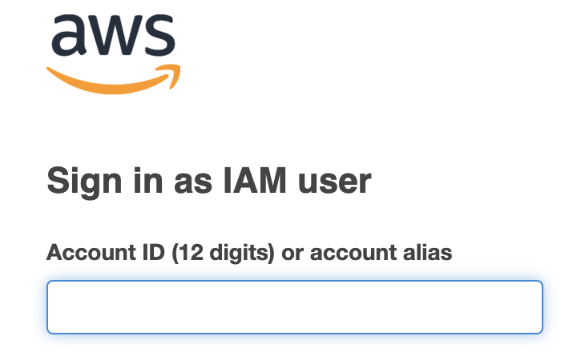

= Todo Fargate

== Warning

This project is an experimental project, to share the experiences made with Fargate, and to share as during the development I found no project containing all these elements.

*ATTENTION:* This project generates costs when deployed on AWS, as Fargate is not part of the Free Tier. During my tests
it was under 1$, even when done a lot of deployments, I cleaned and removed my ECS Tasks and reduced the runtimes as most as possible:


So keep your Budget Plan on eye, configure it, and *REMOVE* your resources after you're finished !!!!

This Project contains 2 parts:

* Rust / Leptos Server Side Rendering
* AWS / Fargate / DynamoDB Deployment

== RUST / LEPTOS

For the part of Leptos, the cargo file is generated by https://book.leptos.dev/ssr/21_cargo_leptos.html
with the commands:

```bash
cargo install cargo-leptos
```

```bash
cargo leptos new --git leptos-rs/start-axum
```

After initialisation, I could take most of my development from my project: https://github.com/oxide-byte/todo-serverless

The main modification points had been:

* The starting of the Axum Server in Main
* The implementation of the Server Side Rendering in the Service (#[server(GetTodos, "/api")]...)
* And a better understanding of Rust Features and #[cfg(feature = "ssr")]

In the docker-compose.yaml you find a local DynamoDB with an UI, to develop and test locally.

You can start the Server locally with (run.sh)
```bash
export local=true
cargo leptos watch
```

The Dockerfile builds the image to transfer to AWS ECR and executed as Fargate Task later. The Docker image could be on the runner part lighter, but for simplicity I kept the Build proposed from Leptos: https://book.leptos.dev/deployment/ssr.html

## AWS

The Deployment of the application is build on CloudFormation SAM, containing nearly all the elements to make the application runnable.

The SAM Template create:

* A CloudWatch Log Group
* A new public network with Subnets, VPC, Internet Gateway, Routing Table, Security Group
* A Fargate ECS Cluster, Task Definition and Service
* A DynamoDB Database

Before applying the SAM Template, you need first in your Region an Elastic Container Registry, where the Docker image of your application is uploaded. For this use the AWS Web Interface and create a new Registry:


You need to replace in Makefile the XXXXXXXXXXXXXXXX from the variable AWS_ID with your own ID (12 Digits)



```
# Image and repository variables
IMAGE_NAME := todo-fargate
AWS_ID := XXXXXXXXXXXXXXXX
REGION_ID := eu-west-1
```

Same for the SAM template.yaml

```
Parameters:
  ImageRepository:
    Type: String
    Default: XXXXXXXXXXXXXX.dkr.ecr.eu-west-1.amazonaws.com/todo-fargate:latest
```

As you see, the project is linked to the region: eu-west-1 (Ireland), if you work with an other region, consider to search and replace the value in the different resources of the project.

In the Makefile, we have the different steps to build the Docker Image and Cloud Formation:

1. Build a Docker image locally on your PC/Laptop with the step: build

2. Tag the image and push it to the ECR with the step: push

3. Build the SAM Template for Cloud Formation, deploy it, and start the ECS Fargate Task (Attention running costs) with the step: aws-sam

```
CloudFormation stack changeset
-------------------------------------------------------------------------------------------------
Operation                LogicalResourceId        ResourceType             Replacement
-------------------------------------------------------------------------------------------------
+ Add                    CloudWatchLogsGroup      AWS::Logs::LogGroup      N/A
+ Add                    SubnetA                  AWS::EC2::Subnet         N/A
+ Add                    SubnetB                  AWS::EC2::Subnet         N/A
+ Add                    TodoCluster              AWS::ECS::Cluster        N/A
+ Add                    TodoDB                   AWS::DynamoDB::Table     N/A
+ Add                    TodoDefinition           AWS::ECS::TaskDefiniti   N/A
+ Add                    TodoExecutionRole        AWS::IAM::Role           N/A
+ Add                    TodoInternetGatewayAtt   AWS::EC2::VPCGatewayAt   N/A
+ Add                    TodoInternetGatewayRou   AWS::EC2::Route          N/A
+ Add                    TodoInternetGateway      AWS::EC2::InternetGate   N/A
+ Add                    TodoRouteTableAssociat   AWS::EC2::SubnetRouteT   N/A
+ Add                    TodoRouteTableAssociat   AWS::EC2::SubnetRouteT   N/A
+ Add                    TodoRouteTable           AWS::EC2::RouteTable     N/A
+ Add                    TodoSecurityGroupEgres   AWS::EC2::SecurityGrou   N/A
+ Add                    TodoSecurityGroupIngre   AWS::EC2::SecurityGrou   N/A
+ Add                    TodoSecurityGroupIngre   AWS::EC2::SecurityGrou   N/A
+ Add                    TodoSecurityGroupIngre   AWS::EC2::SecurityGrou   N/A
+ Add                    TodoSecurityGroup        AWS::EC2::SecurityGrou   N/A
+ Add                    TodoService              AWS::ECS::Service        N/A
+ Add                    TodoVpc                  AWS::EC2::VPC            N/A
-------------------------------------------------------------------------------------------------
```


The public IP can be found inside the Elastic Container Service:


following the task:


and looking on the Network Configuration:


When finished, clean the AWS deployment in using the Step : clean from Makefile or command:

```
sam delete
```

and validate after that all resources have been removed:


== Headache

A point that had made some headache and needed a longer research was an error in the logs of Rust Task:

```
Task stopped at: 2024-03-14T21:29:24.899Z
ResourceInitializationError: unable to pull secrets or registry auth: execution resource retrieval failed: unable to retrieve ecr registry auth: service call has been retried 3 time(s): RequestError: send request failed caused by: Post "https://api.ecr.eu-west-1.amazonaws.com/": dial tcp 63.34.61.49:443: i/o timeout. Please check your task network configuration.
```

In my case it was this part of missing definition on [TodoDefinition]

```
ExecutionRoleArn: !GetAtt TodoExecutionRole.Arn
TaskRoleArn: !GetAtt TodoExecutionRole.Arn
```

An other point on the network, this must be well defined, and the TaskService need access to the Internet Gateway, or it will fail and restart:


Always distinct between the default resources and the created when analysing and debugging for problems.

== Disclaimer

This GitHub project is experimental application for education purpose. It's important to acknowledge that cloud services could generate costs based on usage, configuration, and external factors.

By accessing and utilizing this project, you agree that:

    Cost Management Responsibility: You are responsible for monitoring and managing the costs associated with deploying and running this application in your own cloud environment. This includes understanding the pricing structure of the cloud service provider and making informed decisions to optimize costs.

    Usage and Deployment: You acknowledge that the usage and deployment of this application may result in charges from the cloud service provider. It's essential to review and comprehend the pricing details provided by the cloud service provider before deploying the application.

    No Liability: The creators and contributors of this project are not liable for any costs incurred as a result of deploying, running, or modifying this application. This includes, but is not limited to, charges accrued from cloud services, unexpected usage spikes, or misconfigurations.

    Best Practices and Recommendations: We strongly recommend implementing cost management best practices, such as setting up budget alerts, utilizing cost-effective resources, and regularly reviewing usage reports to avoid unexpected expenses.

    Continuous Monitoring: It's your responsibility to continuously monitor the usage and costs associated with running this application. Periodic reviews of cloud billing statements and resource utilization are essential to ensure cost-effectiveness.

    Feedback and Contributions: We welcome feedback and contributions to enhance the efficiency and cost-effectiveness of this project. However, any changes made to optimize costs should be thoroughly tested to ensure they do not compromise the functionality or security of the application.

By proceeding with the usage of this project, you acknowledge that you have read, understood, and agreed to the terms outlined in this disclaimer. If you do not agree with these terms, refrain from accessing or utilizing this project.